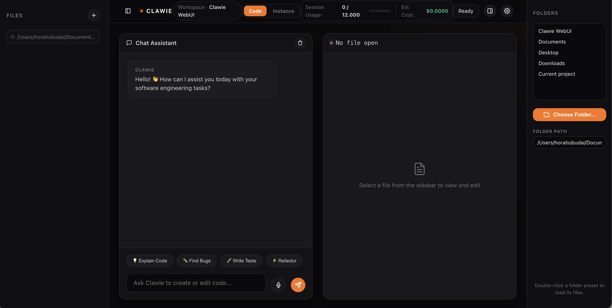
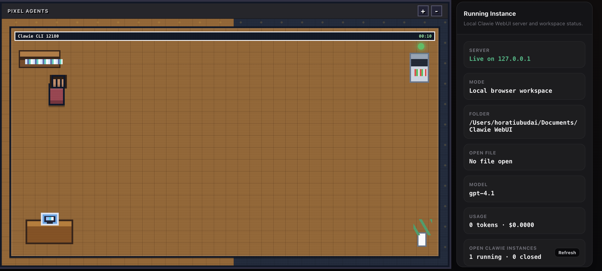

# Clawie by ShrimpAI

Clawie is a packaged workspace that keeps both sides of the project together:

- `rust-clawie` (main CLI/runtime side)
- `python-clawie` (Python mirror/workspace side)

This repository exists so the full project is shareable and runnable from one folder.

## Key Features & Recent Updates

### 1. Interactive Setup Wizard
Configure your environment variables, provider, model, API key, and base URL interactively:
```bash
./clawie setup
```
Settings are persisted in `settings.json` under the Clawie config directory.

### 2. Lazy Senior Dev Mode (Lean Mode)
Clawie enforces a **Lean Ladder** to prevent over-engineering:
1. *Does this need to exist?*
2. *Is it already in this codebase?*
3. *Does stdlib do it?*
4. *Does a native platform feature cover it?*
5. *Does an installed dependency solve it?*
6. *Can it be one line?*
7. *Only then write the minimum code.*

Manage this mode directly inside the REPL session:
- `/lean [lite|full|ultra|off]`: Switch or view the active lean mode (default is `full`).
- `/lean-review`: Review current diff for over-engineering.
- `/lean-audit`: Scan repository for over-engineering.
- `/lean-debt`: Harvest `clawie:` simplification comments into a ledger.
- `/lean-gain`: Show benchmark impact metrics.
- `/lean-help`: Print command reference.

### 3. Repository Mapping
Use the `/map` (or `/repo-map`) command in the REPL to generate a ranked map of the repository's files and extracted symbols, helping navigate large codebases.

### 4. Git Integration
Manage commits directly from the REPL:
- `/commit`: Preflight checks changes, generates a commit message, and commits them.
- `/undo`: Undoes the last commit (soft reset, keeping changes).

### 4.1 Multi-Agent Team Workflow
Coordinate parallel coding safely from the terminal with `/team`:
- `/team spawn <name> <task>` creates an isolated Git worktree and branch.
- `/team assign <name> <file[,file...]>` reserves files to prevent overlapping edits.
- `/team run <name>` starts the agent in its assigned worktree after ownership is set.
- `/team context <task>` provides lazy, task-scoped file context without indexing the full repository.
- `/team ready <name>` runs quality gates and adds the branch to the merge queue.
- `/team merge <name>` merges one reviewed agent branch at a time.

### 5. Workspace RAG Service (`claw-rag-service`)
SQLite-backed vector indexing service for semantic repository searches:
- **Ingest files**: `cargo run -p claw-rag-service -- ingest --workspace .`
- **Serve API & UI**: `cargo run -p claw-rag-service -- serve`

### 6. Web UI Visual Upgrades
Advanced graphical interface features for the local Clawie Web UI:
- **WebSocket Live Log Streaming**: Dynamic real-time execution log streams. Rather than pulling static snapshots, the UI connects to a background socket (`/ws-log`) to monitor process events as they happen.
- **Side-by-Side Visual Diffing**: Compare original files vs agent improvements or current edits. Clicking "Show Diff" provides visual red/green deletions/additions side-by-side with automatic layout alignment.



### 7. Automated Parity Pipelines
Checks sync and parity between the Rust codebase and Python mirrors:
- **Sync Auditor CLI**: `./scripts/check_rust_python_sync.py` analyzes command/tool definitions and file parity.
- **Unit Testing**: Tests defined in `test_rust_python_sync.py` run checks in continuous integration.

### 8. Pixel Agents Dashboard (Visual Interface)
A gamified, real-time pixel-art dashboard showing active agent instances and status:
- **Draggable Agents**: CLI processes are rendered as active pixel-art characters in visual rooms (complete with desks, computers, bookshelves, and server racks).
- **Session Actions**: Terminate active agent sessions directly from the visual interface.
- **State Beacons**: Displays process statuses (thinking, executing, idle, closed) dynamically via color-coded status lights.



## Quick Start

1. Set up the workspace:
```bash
./clawie setup
```

2. Launch the Clawie agent REPL:
```bash
./clawie
```

3. Work in these folders depending on focus:

- `rust-clawie` for CLI/runtime behavior
- `python-clawie` for Python-side mirrored modules and tooling

## Repository Layout

```text
Clawie/
├── README.md
├── clawie
├── rust-clawie/
└── python-clawie/
```

## Long Coding Sessions (Improved)

The runtime defaults were increased to better support longer sessions:

- `max_turns`: `64` (was lower)
- `max_budget_tokens`: `12000` (was lower)
- `compact_after_turns`: `48`
- `turn-loop --max-turns`: default `12`

You can tune these at runtime with environment variables:

```bash
export CLAWIE_MAX_TURNS=120
export CLAWIE_MAX_BUDGET_TOKENS=30000
export CLAWIE_COMPACT_AFTER_TURNS=80
export CLAWIE_STRUCTURED_OUTPUT=false
export CLAWIE_STRUCTURED_RETRY_LIMIT=2
./clawie
```

Notes:

- Invalid values fall back to defaults.
- Numeric values are clamped to at least `1`.

## Useful Commands

Run from repository root.

```bash
# Python-side summary
python3 -m python-clawie.src.main summary

# Run a stateful loop with explicit turn count
python3 -m python-clawie.src.main turn-loop "audit this module" --max-turns 30

# Resume an existing session
python3 -m python-clawie.src.main resume-session <session_id> "continue"

# Validate a CLI transport to infrastructure, e.g. a Codex-style local CLI
python3 -m python-clawie.src.main cli-bridge-mode codex --command "codex exec"

# Execute the CLI transport with a prompt appended as the final argument
python3 -m python-clawie.src.main cli-bridge-mode codex --command "codex exec" --prompt "inspect this workspace" --execute
```

## Use Cases & Workflows

### 1. Live Background Agent Monitoring (WebSocket Logs)
When running complex agent tasks (e.g. running a multi-turn audit session with `/lean-audit`), developers can launch the Web UI alongside their terminal and watch the agent's actions live.
*   **Workflow**:
    1. Start a CLI session: `./clawie`
    2. Open the Web UI by running `/webui` in the CLI REPL or by running `./clawie --webui`
    3. Click on the active room's terminal monitor inside the Web UI dashboard to open the Log Console.
    4. The console connects via WebSocket to `/ws-log?pid=<PID>` and streams process lifecycle updates, command elapsed times, and execution details in real time as the agent runs.

### 2. Code Improvement Review (Side-by-Side Diff)
When Clawie suggests changes to code files, you can review, edit, and apply them using the side-by-side split screen.
*   **Workflow**:
    1. Ask Clawie to improve a file: `"Optimize main.py"` (which generates a `.improvements.md` file).
    2. Open the Web UI and select the file from the workspace explorer sidebar.
    3. Click the **"Show Diff"** button at the top right of the editor.
    4. Compare the **Original File** (left pane, red deletions) and the **Improvements / Edited** (right pane, green additions).
    5. Switch back to the editor with **"Show Editor"** to make manual refinements, then click **"Save"**.

### 3. Continuous Parity Checking (Automated Pipelines)
To ensure that CLI runtime command/tool updates inside `rust-clawie` are mirrored properly inside `python-clawie` without creating feature drift:
*   **Workflow**:
    1. Run the sync check CLI tool: `./scripts/check_rust_python_sync.py`
    2. The tool outputs a detailed parity report comparing commands in Rust `commands.json` vs Python's snapshot, and tool specifications in Rust `tools/src/lib.rs` vs Python's snapshot.
    3. If there are missing files or content drifts, the script exits with code `1`, serving as a validator in Git hooks or CI pipelines.
    4. Run `python3 -m unittest python-clawie/tests/test_rust_python_sync.py` to assert package structure sync.

## Product Naming

- `Clawie`: product name
- `ShrimpAI`: parent brand
- `Jameclaw`: legacy/origin naming context

## Why This Package Exists

Earlier working copies were split across multiple local folders. This package keeps everything in one Git-ready structure so onboarding, development, and sharing are simpler.


